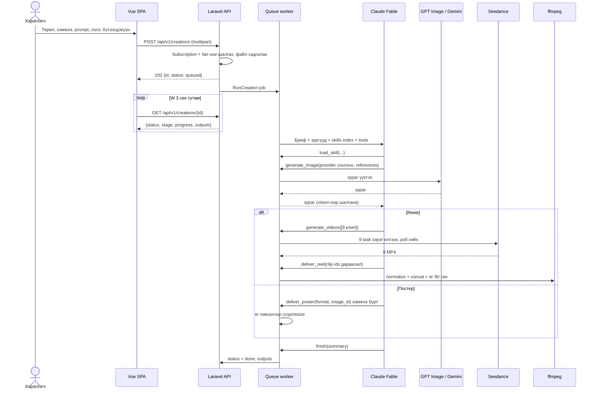
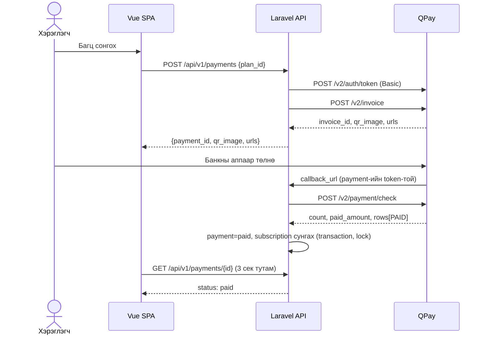
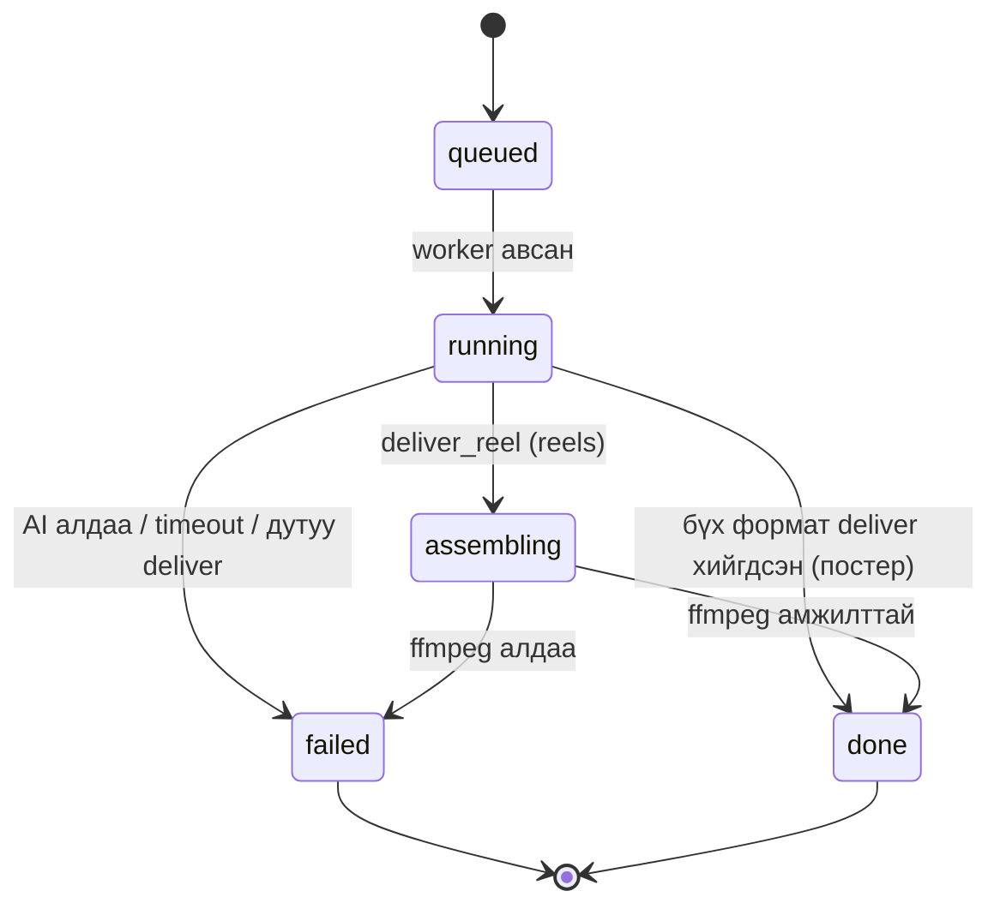
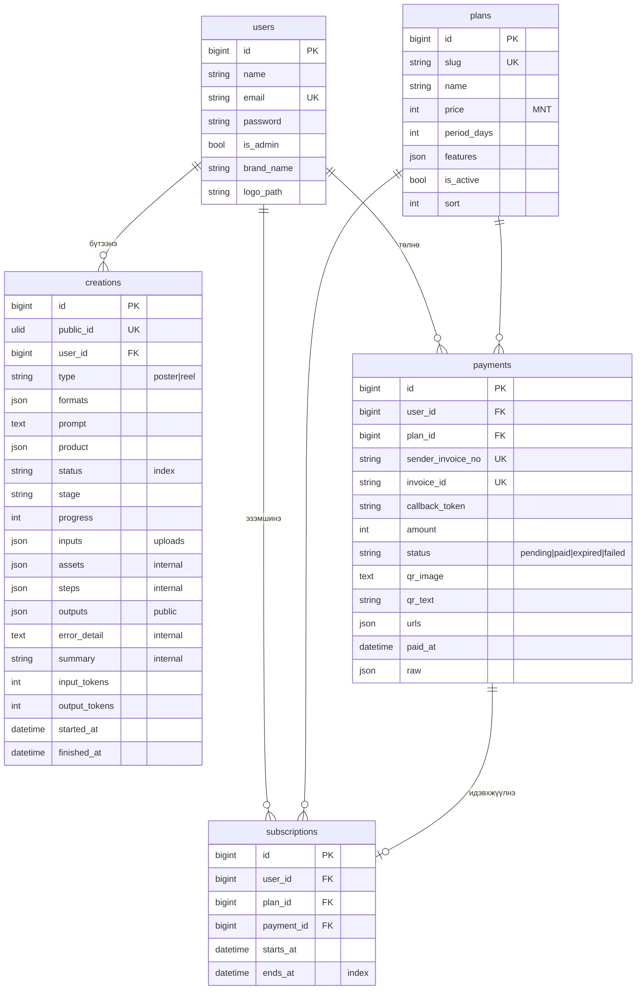

# Poster Studio — Системийн шаардлагын тодорхойлолт (SRS)

Хувилбар 2.0 · 2026-10-10

## 1. Зорилго ба хүрээ

### 1.1 Бизнесийн зорилго
Жижиг, дунд бизнес эрхлэгч Facebook, Instagram-д тавих **постер** болон **1:30 минутын reels видео**-г дизайнер, видеографчгүйгээр, хэдхэн минутад авна.

### 1.2 Өмнөх хувилбараас өөрчлөгдсөн зүйл (AS-IS → TO-BE)

| # | AS-IS (v1) | TO-BE (v2) | Шалтгаан |
|---|---|---|---|
| 1 | Хэрэглэгч текст/зураг моделиа өөрөө сонгоно | Модель сонголт хэрэглэгчээс бүрэн нуугдана. Claude Fable шийднэ | Хэрэглэгчид техникийн сонголт хэрэггүй, үр дүн л чухал |
| 2 | Постерын дээр canvas-аар гарчиг, CTA бичнэ | Текст давхарлахгүй. AI-ийн үүсгэсэн зураг өөрөө эцсийн бүтээгдэхүүн | Шаардлага: "дээр нь текст бичих шаардлагагүй" |
| 3 | Reels = зургууд + ken-burns, хөтөч дээр бодит хугацаанд бичнэ (MediaRecorder) | Reels = Seedance-ийн видео клипүүд, сервер дээр ffmpeg-ээр **яг 90 секунд** MP4 болгож угсарна | Шаардлага: "reels 1:30 бүтнээрээ ирнэ" |
| 4 | Нэвтрэлт, төлбөргүй | Бүртгэл + QPay захиалга (subscription), хязгааргүй багц | Бизнес загвар |
| 5 | Постер, Reels, Агент, Галерей, Skills — 5 хэрэгсэл | Нэг "Бүтээх" урсгал + Миний бүтээлүүд + Багц. Skills, тайлан admin-д | Хялбар UX |
| 6 | Гараар засах editor-ууд | Editor-гүй. Сэтгэл хангалуун бус бол дахин үүсгэнэ | Зорилгод төвлөрөх |

### 1.3 Хүрээнээс гадуур (Won't, v2)
- Постер/видео дээр текст засах editor
- Сошиал сүлжээ рүү шууд нийтлэх
- Voiceover, дуу хоолой үүсгэх
- Олон хэрэглэгчтэй багийн (team) бүртгэл
- QPay автомат давтагдах төлбөр (QPay дэмждэггүй, сунгалтыг гараар хийнэ)

## 2. Оролцогчид (Actors)

| Actor | Тайлбар |
|---|---|
| Зочин | Нүүр хуудас, үнийн мэдээлэл үзнэ, бүртгүүлнэ |
| Захиалагч (Subscriber) | Идэвхтэй багцтай. Постер, reels бүтээнэ, татаж авна |
| Захиалгагүй хэрэглэгч | Бүртгэлтэй ч багцгүй, эсвэл багц нь дууссан. Бүтээлүүдээ үзнэ, шинээр үүсгэж чадахгүй |
| Админ | Skills, багц/үнэ, бүх бүтээлийн дотоод лог (ямар модель, хэдэн токен) харна |
| Claude Fable (систем) | Брифийг боловсруулж, аль AI-г дуудахыг шийднэ |
| GPT Image, Gemini, Seedance (гадаад) | Зураг / видео үүсгэнэ |
| QPay (гадаад) | Төлбөр хүлээн авна, callback илгээнэ |

## 3. Функциональ шаардлага

| ID | Шаардлага | MoSCoW |
|---|---|---|
| FR-01 | Хэрэглэгч имэйл, нууц үгээр бүртгүүлж, нэвтэрч, гарна | Must |
| FR-02 | Хэрэглэгч бүтээлийн төрлийг сонгоно: **Постер** эсвэл **Reels** | Must |
| FR-03 | Постерт нэг буюу хэд хэдэн хэмжээ сонгоно: IG/FB пост 4:5 (1080×1350), IG/FB квадрат 1:1 (1080×1080), Story 9:16 (1080×1920), FB хэвтээ 1.91:1 (1200×628) | Must |
| FR-04 | Хэрэглэгч prompt (юу хүсэж байгаа) бичнэ | Must |
| FR-05 | Хэрэглэгч лого (≤1) болон бүтээгдэхүүний зураг (≤5) хавсаргана. JPG/PNG/WEBP, ≤10MB | Must |
| FR-06 | Хэрэглэгч бүтээгдэхүүний мэдээлэл (нэр, үнэ, тайлбар) оруулна. Заавал биш | Must |
| FR-07 | Лого болон брэндийн нэрийг профайлд хадгалж, дараагийн бүтээлд автоматаар ашиглана | Should |
| FR-08 | Систем брифийг Claude Fable-д skills-тэй хамт өгч, Fable prompt-ыг боловсруулж, зураг/видеог аль AI-д үүсгүүлэхийг **өөрөө** шийднэ | Must |
| FR-09 | Fable үүсгэсэн зураг бүрийг (vision-оор) шалгаж, муу бол дахин үүсгэнэ (нэг asset-д ≤2 удаа) | Must |
| FR-10 | Постер: сонгосон хэмжээ бүрт нэг зураг, яг тухайн пикселийн хэмжээгээр | Must |
| FR-11 | Reels: 9:16, 1080×1920, 30fps, H.264 MP4, **яг 90.0 секунд**. Клипүүдийг сервер дээр угсарна | Must |
| FR-12 | Үүсгэх явцыг хэрэглэгчид ойлгомжтой үе шат + хувиар харуулна (модель нэргүй) | Must |
| FR-13 | Үр дүнг вэб дээр харуулж (зураг / видео тоглуулагч), татаж авах товчтой | Must |
| FR-14 | Хэрэглэгчид аль модель ашигласныг UI, API хариу, файлын нэр — **аль ч газар** харуулахгүй | Must |
| FR-15 | "Миний бүтээлүүд": өмнөх бүтээлүүд, төлөв, дахин нээх, устгах | Must |
| FR-16 | Ижил брифээр дахин үүсгэх | Should |
| FR-17 | Багцын жагсаалт (нэр, үнэ, хугацаа) | Must |
| FR-18 | Багц сонгоход QPay нэхэмжлэх үүсч, QR + банкны аппын линк харуулна | Must |
| FR-19 | Төлбөр төлөгдөхөд (callback эсвэл шалгалтаар) захиалга автоматаар идэвхжинэ/сунгагдана | Must |
| FR-20 | Хэрэглэгч багцынхаа дуусах огноог харна | Must |
| FR-21 | Захиалгагүй хэрэглэгч "Бүтээх" дарахад багц сонгох хуудас руу шилжинэ | Must |
| FR-22 | Админ skills нэмэх, засах, унтраах | Must |
| FR-23 | Админ багцын үнэ, хугацааг өөрчилнө | Should |
| FR-24 | Админ бүтээл бүрийн дотоод лог (алхам, модель, токен, үүсгэсэн asset-ын тоо) харна | Should |
| FR-25 | Fair-use: нэг хэрэглэгч зэрэг ≤2 бүтээл ажиллуулна. Өдрийн хязгаарыг тохиргоогоор асааж болно | Must |

## 4. Бизнесийн дүрэм

| ID | Дүрэм |
|---|---|
| BR-01 | Шинэ бүтээл эхлүүлэхэд идэвхтэй захиалга (`ends_at > now`) заавал байна |
| BR-02 | Хязгааргүй багц нь хэмжээгээр хязгаарлахгүй. Зардлыг fair-use (BR-03) хамгаална |
| BR-03 | Хэрэглэгчийн `queued` + `running` бүтээл ≤ `CREATIONS_MAX_ACTIVE` (default 2) |
| BR-04 | Сунгалт: шинэ `ends_at = max(now, одоогийн ends_at) + plan.period_days` |
| BR-05 | Нэг төлбөр нэг л удаа захиалга идэвхжүүлнэ (idempotent) |
| BR-06 | Төлсөн дүн < нэхэмжлэхийн дүн бол идэвхжүүлэхгүй |
| BR-07 | Постерт текст давхарлахгүй. Хэрэглэгч prompt-доо тодорхой текст хүссэн тохиолдолд л AI зурган дотор бичүүлж болно |
| BR-08 | Хэрэглэгчийн хавсаргасан бодит бүтээгдэхүүн, логог өөрчилж болохгүй (reference ашиглана) |
| BR-09 | Reels-ийн нийт урт яг 90 сек. Клипүүдийн нийлбэр ≥90 сек байх ёстой. Илүүг таслана, дутууг сүүлийн кадраар нөхнө |
| BR-10 | Бүтээл амжилтгүй болбол хэрэглэгчид ерөнхий мессеж харуулна. Техникийн шалтгааныг зөвхөн админ харна |
| BR-11 | Хэрэглэгч зөвхөн өөрийн бүтээлийг харна (админ бүгдийг) |

## 5. Үндсэн урсгал

### 5.1 Бүтээл үүсгэх (sequence)

### 5.2 Захиалга (QPay)

Callback ирэхгүй тохиолдолд хэрэглэгчийн poll-оор `payment/check`-ийг 10 секундэд нэгээс олонгүй дуудна.

## 6. Төлөвийн машин

Payment: `pending → paid` | `pending → expired` (24 цаг) | `pending → failed`.
Subscription: `active` (ends_at > now) → `expired` (тооцоолсон төлөв, хадгалахгүй).

## 7. Өгөгдлийн загвар

`skills` хүснэгт хэвээр (admin custom skills).

## 8. API (v1)

Бүх хариу JSON. Алдаа: `{message, code?, errors?}`. Auth: Laravel session cookie + CSRF (SPA нь ижил domain-оос үйлчлэгдэнэ).

| Method | Endpoint | Эрх | Тайлбар |
|---|---|---|---|
| POST | `/api/v1/auth/register` | зочин | `name, email, password, password_confirmation` |
| POST | `/api/v1/auth/login` | зочин | 5 оролдлого/мин хязгаартай |
| POST | `/api/v1/auth/logout` | auth | |
| GET | `/api/v1/me` | — | хэрэглэгч + захиалга (`null` бол зочин) |
| POST | `/api/v1/me/brand` | auth | `brand_name`, `logo`, `remove_logo` (multipart) |
| GET | `/api/v1/meta` | — | постерын формат, reels тохиргоо |
| GET | `/api/v1/plans` | — | идэвхтэй багцууд |
| POST | `/api/v1/payments` | auth | `{plan_id}` → QR, deeplinks |
| GET | `/api/v1/payments/{id}` | эзэн | төлөв (pending бол throttled check) |
| GET/POST | `/api/v1/payments/qpay/callback/{token}` | QPay | баталгаажуулалт `payment/check`-ээр |
| GET | `/api/v1/creations` | auth | хуудаслалттай жагсаалт |
| POST | `/api/v1/creations` | subscribed | `type, formats[], prompt, product{name,price,description}, logo, images[], use_saved_logo` |
| GET | `/api/v1/creations/{public_id}` | эзэн | `{id, type, status, stage, progress, outputs, error}` — модель, prompt-ын дотоод мэдээлэлгүй |
| POST | `/api/v1/creations/{public_id}/retry` | subscribed эзэн | ижил брифээр шинэ бүтээл |
| DELETE | `/api/v1/creations/{public_id}` | эзэн | |
| GET | `/api/v1/admin/creations` | admin | дотоод лог бүхий |
| CRUD | `/api/v1/admin/skills` | admin | |
| GET/PUT | `/api/v1/admin/plans` | admin | |

Алдааны кодууд: `401` нэвтрээгүй · `402 subscription_required` · `403` эрхгүй · `422` validation · `429 too_many_active` / throttle.

## 9. Функциональ бус шаардлага

| ID | Шаардлага |
|---|---|
| NFR-01 | Постер (1 формат) ≤ 3 мин, reels ≤ 25 мин дотор дуусна (Seedance-ийн клипүүдийг зэрэг илгээнэ) |
| NFR-02 | AI дуудлагууд queue дээр. HTTP хүсэлт 2 сек-ээс удаан хүлээлгэхгүй |
| NFR-03 | Queue job timeout 3600 сек, `retry_after` > timeout |
| NFR-04 | API түлхүүрүүд зөвхөн сервер дээр. Frontend bundle-д байхгүй |
| NFR-05 | Файл upload: MIME + хэмжээ шалгана. Үр дүнгийн файлын нэр UUID (таах боломжгүй) |
| NFR-06 | Нууц үг bcrypt. Нэвтрэх оролдлогыг rate limit-тэй. CSRF хамгаалалттай |
| NFR-07 | UI монгол хэлээр, mobile-д зохицсон |
| NFR-08 | Admin лог-оор бүтээл бүрийн AI зардлыг (токен, зураг/видеоны тоо) тооцох боломжтой |
| NFR-09 | Сервер дээр ffmpeg (libx264) суусан байна. Reels-д заавал |

## 10. Эрсдэл

| Эрсдэл | Нөлөө | Магадлал | Бууруулах арга |
|---|---|---|---|
| Хязгааргүй багцад нэг хэрэглэгч олон reels үүсгэж Seedance-ийн зардал өсөх (1 reels ≈ 9×10с клип) | Өндөр | Дунд | BR-03 зэрэг ажиллах хязгаар, `CREATIONS_DAILY_REELS` тохиргоо, admin зардлын лог. **Үнийг тооцохдоо reels-ийн өртгийг заавал оруулах** |
| Seedance-ийн клип алдаатай/удаан | Дунд | Дунд | Клип бүрт timeout, Fable-д алдааг буцааж дахин үүсгүүлэх, нийт job timeout |
| Зураг дээр кирилл текст муу гарах | Дунд | Өндөр | Default-аар текстгүй (BR-07) |
| QPay callback ирэхгүй | Дунд | Бага | Хэрэглэгчийн poll-оор throttled `payment/check` |
| Бүтээгдэхүүн/лого AI-д өөрчлөгдөх | Өндөр | Дунд | Reference-тэй Gemini, Fable vision-оор шалгах, skill-ийн заавар |
| Модель нэр алдагдах | Бага | Бага | Хэрэглэгчийн API-д тусдаа Resource, feature test-ээр баталгаажуулна |

## 11. Таамаглал

1. Багцын үнийг seeder-т жишээ байдлаар оруулсан (сар 49,000₮ / 3 сар 129,000₮ / жил 449,000₮). Админ өөрчилнө.
2. Reels-д дуу/хөгжим нэмэхгүй (чимээгүй audio track-тай MP4, платформд тохирно). Seedance дуу үүсгэвэл хадгална.
3. Хэрэглэгчийн upload болон үр дүнг public disk дээр UUID нэртэй хадгална. Signed URL дараагийн шатанд.
4. Постерын пост бичвэр (caption, hashtag) үүсгэхгүй. Шаардлагад "текст хэрэггүй" гэсэн.
5. Нэг бүтээлд Claude Fable `effort=high`.

## 12. Нээлттэй асуултууд

1. Багцын бодит үнэ, хугацаа? Нэг reels-ийн AI өртгийг тооцоод тогтоох хэрэгтэй.
2. Хөгжим нэмэх үү (royalty-free сан, эсвэл хэрэглэгч upload)?
3. Постерын пост бичвэр, hashtag хэрэгтэй юу?
4. Үнэгүй туршилт (trial) өгөх үү? Жишээ нь бүртгүүлэхэд 1 постер.
5. И-баримт (e-Barimt) гаргах шаардлагатай юу? QPay-ийн `ebarimt` endpoint-оор нэмж болно.
